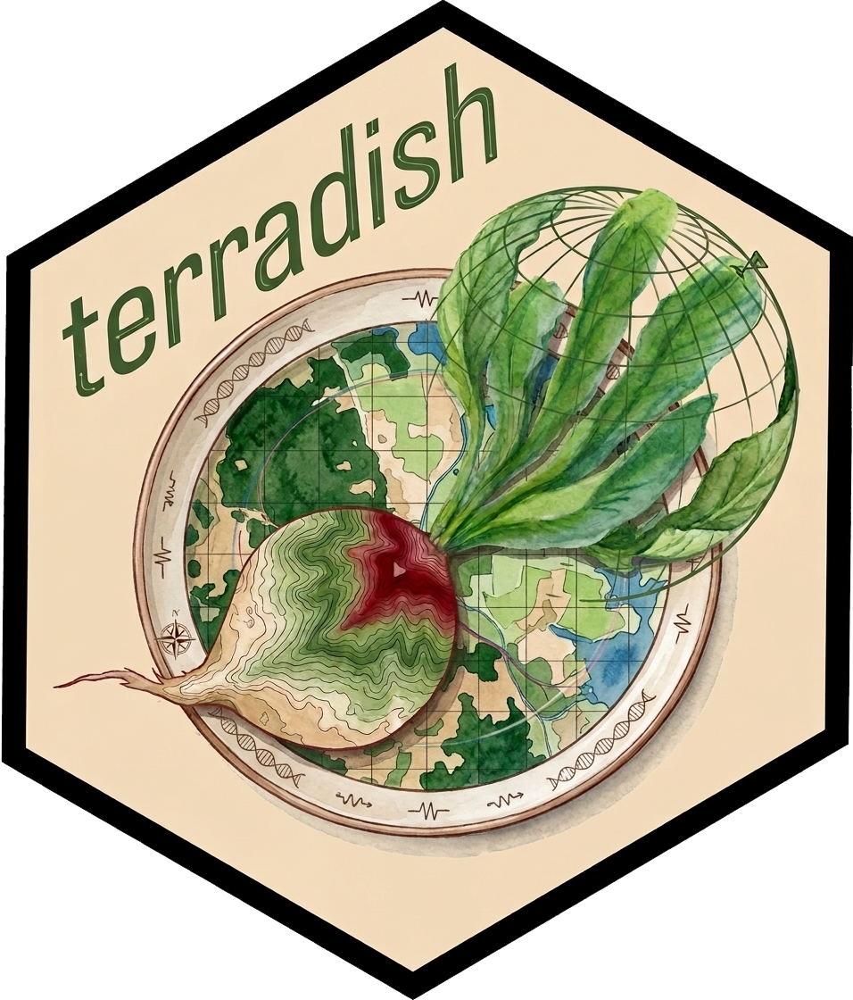

# **terradish** 

### Fast gradient-based optimization of resistance surfaces for landscape genetics.

`terradish` is an R package for maximum likelihood estimation of isolation-by-resistance (IBR) models. The core optimization infrastructure (sparse Laplacian factorization, reverse-mode gradient backpropagation through the graph Laplacian, and the MLPE and generalized Wishart likelihood layers) was developed by **Nate Pope** as the [`radish`](https://github.com/nspope/radish) R package. `terradish` is a `terra`-native extension of that framework, adding new measurement models, Gaussian scale-of-effect optimization, IBE + IBR joint fitting, cross-validation tools, improved visualization, and a suite of helper utilities, while preserving full backward compatibility with `radish` function names.

The central idea is **isolation by resistance (IBR)**: instead of assuming genetic distance simply tracks straight-line geographic distance (isolation by distance, IBD), IBR recognizes that the landscape is heterogeneous. Some cells are easy to cross; others are barriers. `terradish` estimates how raster covariates (altitude, forest cover, roads, etc.) shape this permeability using efficient sparse linear algebra and analytic gradients throughout.

## Key features

-   Four **measurement models**: `leastsquares`, `mlpe`, `generalized_wishart`, `wishart_covariance`
-   Three **conductance models**: `loglinear_conductance` (standard log-linear), `smooth_loglinear_conductance` (spline terms), and `gaussian_smoothed_loglinear_conductance` (with estimated spatial scale of effect)
-   Support for **quadratic** (`I(x^2)`) and **interaction** (`x * z`) terms in conductance formulas
-   Four **plot types**: observed-vs-fitted (`"fit"`), conductance surface with CI (`"surface"`), marginal effects on the genetic distance scale (`"marginal_response"`, default), and marginal effects on the conductance scale (`"marginal"`)
-   **IBE + IBR** joint modeling via `pairwise_endpoint_covariates()` and `mlpe_covariates()`
-   **Model comparison**: `aic_table()`, `anova()`, `terradish_grid()`
-   **Cross-validation**: `terradish_cv()`, `terradish_cv_replicates()`, `cv_model_selection()`
-   **Selected-pair analyses**: `pair_subset_measurement_model()` retains all sites in the graph while fitting only chosen pairwise observations
-   **Large-raster helpers**: focal-site cropping with `crop_buffer`, coarse-raster warm starts, `terradish_solver_benchmark()`, and `terradish_assess_settings()`
-   `terra`-native throughout; `radish*` legacy names work with deprecation warnings during transition

## Installation

``` r
# Install from local source (recommended while in development)
devtools::install()
# or
remotes::install_local(".")

# corMLPE is also required (not on CRAN)
devtools::install_github("nspope/corMLPE")
```

## Conceptual overview

The workflow has four steps:

1.  **Build a conductance surface**: maps raster covariates to a weighted graph over the grid.
2.  **Compute resistance distances**: effective distances between sampling locations that account for the full landscape structure.
3.  **Fit a statistical model**: relates those resistance distances to observed genetic distances.
4.  **Optimize**: parameters estimated by maximum likelihood using sparse Cholesky factorization and analytic gradients.

```         
Raster covariates                   Sampling locations
(altitude, forestcover)             (GPS coordinates)
        |                                  |
        +-----> conductance_surface() <----+
                        |
                        v
              terradish(formula, surface,
                        conductance_model,
                        measurement_model)
                        |
                        v
                   fitted model
                   coef(), summary(), plot(), anova()
```

## Quick start

``` r
library(terradish)
library(terra)

data(melip)
melip.altitude    <- terra::unwrap(melip.altitude)
melip.forestcover <- terra::unwrap(melip.forestcover)
melip.coords      <- terra::unwrap(melip.coords)

# Scale covariates — important for numerical stability in the log-linear model
covariates <- c(melip.altitude, melip.forestcover)
names(covariates) <- c("altitude", "forestcover")
covariates <- scale_covariates(covariates)

# Build the weighted graph
surface <- conductance_surface(covariates, melip.coords, directions = 8)

# Fit an IBR model
fit <- terradish(
  melip.Fst ~ forestcover + altitude,
  data              = surface,
  conductance_model = loglinear_conductance,
  measurement_model = mlpe
)

summary(fit)

# Visualize
plot(fit, data = surface)                    # marginal effects on genetic distance (default)
plot(fit, type = "surface", data = surface)  # fitted conductance surface + 95% CI
plot(fit, type = "fit")                      # observed vs. fitted scatter
plot(fit, type = "marginal", data = surface) # marginal effects on conductance

# Optional: constrain predictions to focal support for unstable tails
plot(fit, type = "marginal", data = surface,
     support = "focal", support_probs = c(0.01, 0.99),
     clamp_covariates = c("forestcover", "altitude"))
cond_focal <- conductance(surface, fit,
                          support = "focal",
                          support_probs = c(0.01, 0.99),
                          clamp_covariates = c("forestcover", "altitude"))
```

## Selected pair analyses

You can retain all focal sites in the conductance graph while fitting the
measurement model to only a chosen subset of pairwise observations. This
is useful when the sampling design, biological hypothesis, or validation
scheme focuses on selected comparisons rather than the full pairwise
distance matrix.

``` r
selected_pairs <- rbind(
  c(1, 2),
  c(1, 4),
  c(3, 5)
)

pair_mlpe <- pair_subset_measurement_model(mlpe, selected_pairs)

fit_subset <- terradish(
  melip.Fst ~ forestcover + altitude,
  data              = surface,
  conductance_model = loglinear_conductance,
  measurement_model = pair_mlpe
)
```

The graph solve still retains all sites, but the likelihood and MLPE
correlation structure are evaluated only for the selected pair rows.

## Measurement models

`terradish` provides four measurement models. The right choice depends on the form of your genetic data and how you want to handle the non-independence of pairwise observations.

| Model | Input `S` | Requires `nu` | Correlation structure |
|----|----|----|----|
| `leastsquares` | distance matrix | no | independent errors |
| `mlpe` | distance matrix | no | MLPE shared-site correction |
| `generalized_wishart` | distance matrix | yes | Wishart (McCullagh 2009) |
| `wishart_covariance` | **covariance** matrix | yes | Wishart |

**`leastsquares`** is the fastest and simplest model. It treats all pairwise genetic distances as independent observations and is a useful quick pass, but it underestimates standard errors because it ignores the shared-site correlation structure.

**`mlpe`** ("maximum likelihood population effects") corrects for the non-independence that arises because every pair (A–B) and (A–C) both involve site A. This is the recommended default for distance-matrix data when the number of genetic markers is not recorded.

**`generalized_wishart`** models the observed distance matrix as arising from a generalized Wishart distribution (McCullagh 2009, Peterson et al. 2019). It requires `nu`, the number of genetic markers used to compute `S`. This is the principled choice when that count is available.

**`wishart_covariance`** is the Wishart analogue for data supplied as a covariance matrix (e.g. from `cov_from_biallelic()`) rather than a distance matrix. It also requires `nu`.

See `vignette("wishart-covariance", package = "terradish")` for a covariance-based workflow that starts from raw genotype data and fits with `wishart_covariance`.

``` r
# Standard MLPE fit
fit_mlpe <- terradish(
  melip.Fst ~ forestcover + altitude,
  data              = surface,
  conductance_model = loglinear_conductance,
  measurement_model = mlpe
)

# Wishart fit — supply the number of genetic markers as nu
fit_gw <- terradish(
  melip.Fst ~ forestcover + altitude,
  data              = surface,
  conductance_model = loglinear_conductance,
  measurement_model = generalized_wishart,
  nu                = 8
)

# Compare models
aic_table(
  list(fit_mlpe, fit_gw),
  mod_names = c("mlpe", "generalized_wishart")
)
```

## Conductance models

**`loglinear_conductance`** is the standard model: conductance at each cell = exp(θ₁·x₁ + θ₂·x₂ + ...). A positive θ for a covariate means that higher values increase conductance (easier movement) at higher levels; a negative θ means the covariate impedes movement at higher levels. The model supports `I(x^2)` and `x * z` interaction terms in the formula.

**`smooth_loglinear_conductance`** extends the log-linear model with spline terms such as `s(altitude, df = 4)` for non-linear conductance responses.

**`gaussian_smoothed_loglinear_conductance()`** jointly estimates conductance coefficients and the spatial scale of effect (σ) at which each covariate influences conductance. Rather than pre-smoothing rasters at fixed scales, this model optimizes σ inside the likelihood calculation using analytic gradients and BFGS.

``` r
# Gaussian scale model: use the raw raster and retain it with saveStack = TRUE
names(melip.forestcover) <- "forestcover"
surface_raw <- conductance_surface(
  melip.forestcover, 
  melip.coords,
  directions = 8, 
  saveStack = TRUE
)

fit_gaussian <- terradish(
  melip.Fst ~ forestcover,
  data              = surface_raw,
  conductance_model = gaussian_smoothed_loglinear_conductance(surface_raw),
  measurement_model = mlpe,
  optimizer         = "auto",
  leverage          = FALSE
)

gaussian_scale_summary(fit_gaussian)   # sigma in map units, cell widths, and radii
plot(fit_gaussian, type = "sigma")     # Gaussian kernel plot with uncertainty band

# Optional coarse-raster warm start for larger rasters. With exact_refine = TRUE,
# the reported fit is still refined on the original full-resolution graph.
fit_gaussian_coarse <- terradish(
  melip.Fst ~ forestcover,
  data              = surface_raw,
  conductance_model = gaussian_smoothed_loglinear_conductance(surface_raw),
  measurement_model = mlpe,
  approximation     = "coarse_raster",
  approximation_control = list(factor = c(4, 2), exact_refine = TRUE),
  optimizer         = "auto",
  leverage          = FALSE
)
```

See `vignette("spline-conductance", package = "terradish")` for spline conductance models and `vignette("gaussian-scale-optimization", package = "terradish")` for a staged workflow that fits single-raster scale-aware models, compares them to fixed-raster fits, and inspects `sigma` before adding additional landscape variables.

## Working with larger rasters

Large rasters are expensive because every likelihood evaluation builds or updates a sparse graph Laplacian, factorizes it, and solves for effective distances among focal sites. `terradish` includes three opt-in tools that address different parts of that cost.

### Crop to the sampled landscape

If your sampling sites occupy only a small part of a much larger raster, crop the raster before graph construction:

``` r
surface_cropped <- conductance_surface(
  covariates,
  melip.coords,
  directions   = 8,
  saveStack    = TRUE,
  crop_buffer  = 0.05
)
```

The buffer is in the raster's map units. For longitude/latitude rasters, that means degrees; for direct distance interpretation, use a projected raster. Cropping is most helpful when sites are clustered. If sites span the whole raster, there may be little or no speed gain.

### Use coarse-raster warm starts

Coarse-raster approximation optimizes first on one or more aggregated rasters, then optionally refines on the original graph:

``` r
fit_coarse <- terradish(
  melip.Fst ~ forestcover + altitude,
  data              = surface,
  conductance_model = loglinear_conductance,
  measurement_model = mlpe,
  approximation     = "coarse_raster",
  approximation_control = list(
    factor       = c(4, 2),
    exact_refine = TRUE
  )
)
```

With `exact_refine = TRUE`, the final coefficients, likelihood, and standard errors come from the full-resolution graph. The coarse stages are only used to find a better starting point. With `exact_refine = FALSE`, the fit is faster but approximate and is best treated as a screening result.

### Benchmark direct solver settings

The fastest direct Cholesky factorization setting depends on graph size and the local R/BLAS build. Use `terradish_solver_benchmark()` as a quick diagnostic:

``` r
terradish_solver_benchmark(
  surface,
  factorization = c("simplicial_ldl", "simplicial_ll", "supernodal_ll"),
  n_replicates = 2
)
```

For small example rasters, timings can be noisy. This benchmark is most useful on rasters large enough that the linear solve is a visible part of runtime.

### Ask terradish to assess settings

`terradish_assess_settings()` combines a graph profile with short, optional probe benchmarks. It returns an advisory recommendation for the optimizer, line search, direct solver settings, and whether a coarse-raster warm start appears worthwhile:

``` r
assessment <- terradish_assess_settings(
  melip.Fst ~ forestcover + altitude,
  data              = surface,
  conductance_model = loglinear_conductance,
  measurement_model = mlpe,
  probe_maxit       = 2,
  coarse_probe      = FALSE
)

assessment
assessment$recommended
```

The assessment is intentionally conservative. It does not change defaults or refit your final model automatically; instead, inspect the recommendation and pass the suggested pieces into `terradish()` when they make sense for your analysis.

## IBE and IBR joint modeling

Isolation by environment (IBE) and isolation by resistance (IBR) can operate simultaneously. `terradish` fits them together cleanly:

-   The **conductance side** captures IBR: raster covariates and landscape resistance distances.
-   The **measurement side** captures IBE: pairwise environmental difference covariates enter as additional predictors in the MLPE model.

`pairwise_endpoint_covariates()` builds pairwise environmental difference matrices from point-level data; `mlpe_covariates()` extends the MLPE measurement model to include them.

``` r
# Pairwise environmental differences at sampling sites
Z <- pairwise_endpoint_covariates(melip.coords, covariates)

# Joint IBE + IBR model
fit_ibe_ibr <- terradish(
  melip.Fst ~ forestcover + altitude,
  data              = surface,
  conductance_model = loglinear_conductance,
  measurement_model = mlpe_covariates(Z)
)

summary(fit_ibe_ibr)
```

See `vignette("ibe-ibr-workflow", package = "terradish")` for a full guided walkthrough including interpretation of IBE vs. IBR coefficients and marginal-effect plots.

## Model comparison and selection

### Likelihood ratio tests

``` r
# Is forest cover a significant predictor after accounting for altitude?
fit_altitude_only <- terradish(
  melip.Fst ~ altitude,
  data = surface, conductance_model = loglinear_conductance,
  measurement_model = mlpe
)
anova(fit_full, fit_altitude_only)
```

### Information criteria

`aic_table()` ranks any collection of fitted `terradish` models by AIC, AICc, or BIC:

``` r
aic_table(
  list(fit_ibd, fit_altitude_only, fit_fc_only, fit_full),
  mod_names = c("IBD", "Altitude", "Forest cover", "Full")
)

# AICc (recommended when sample size is small relative to parameters)
aic_table(..., AICc = TRUE)

# BIC for stricter parsimony
aic_table(..., BIC = TRUE)
```

### Likelihood surface

`terradish_grid()` evaluates the log-likelihood at every point on a user-specified parameter grid, which is useful for diagnosing identifiability and visualizing the shape of the likelihood surface:

``` r
theta_grid <- as.matrix(expand.grid(
  forestcover = seq(-1, 1, length.out = 21),
  altitude    = seq(-1, 1, length.out = 21)
))

grid_result <- terradish_grid(
  theta             = theta_grid,
  formula           = melip.Fst ~ forestcover + altitude,
  data              = surface,
  conductance_model = loglinear_conductance,
  measurement_model = mlpe
)
```

## Cross-validation

Information criteria measure in-sample fit. Cross-validation measures out-of-sample predictive ability.

``` r
# Single train/test split
cv_result <- terradish_cv(
  pts        = melip.coords,
  covariates = covariates,
  fmla       = melip.Fst ~ forestcover + altitude,
  model      = mlpe,
  prop_train = 2/3,
  seed       = 42
)
cat("Held-out log-likelihood:", round(cv_result$cv_loglik, 2))

# Repeated cross-validation across many random splits
cv_reps <- terradish_cv_replicates(
  pts        = melip.coords,
  covariates = covariates,
  fmla       = melip.Fst ~ forestcover + altitude,
  model      = mlpe,
  seeds      = 1:10
)
summary(cv_reps)

# Compare two models using held-out log-likelihood
cv_comparison <- cv_model_selection(
  list(cv_simple, cv_full),
  cv_names = c("Simple", "Full"),
  aic      = TRUE
)
```

See `vignette("model-comparison", package = "terradish")` for a detailed walkthrough of all three comparison approaches (LRT, AIC, CV).

## Vignettes

| Vignette | Topic |
|----|----|
| `vignette("getting-started", package = "terradish")` | Core workflow: fitting, interpreting, and visualizing |
| `vignette("model-comparison", package = "terradish")` | LRT, AIC, cross-validation, likelihood surfaces |
| `vignette("ibe-ibr-workflow", package = "terradish")` | Joint IBE + IBR fitting |
| `vignette("wishart-covariance", package = "terradish")` | Covariance-based Wishart IBR from genotype data |
| `vignette("spline-conductance", package = "terradish")` | Non-linear conductance responses with spline terms |
| `vignette("gaussian-scale-optimization", package = "terradish")` | Gaussian scale-of-effect estimation |

## Attribution

The core optimization infrastructure in `terradish` (sparse Cholesky factorization of the graph Laplacian, reverse-mode gradient backpropagation, and the MLPE and generalized Wishart likelihood layers) was developed by **Nate Pope** as the [`radish`](https://github.com/nspope/radish) R package. `terradish` builds on that foundation while extending it with new capabilities. Full backward compatibility with `radish` entry points is maintained.

Contact Bill Peterman (Peterman.73\@osu.edu) or submit an issue on GitHub for bug reports and feature requests.

<p align="center"></p>
